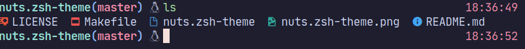

# linux-nuts.zsh-theme

> It's a little forked modification for original "nuts"

```
$ git clone https://github.com/rafaelsq/nuts.zsh-theme.git
$ cd nuts.zsh-theme
$ make link
```

go to your .zshrc file and change ZSH_THEME to this new one

```
$ cd ~/.zshrc
ZSH_THEME=nuts
```
<p>
  
</p>

